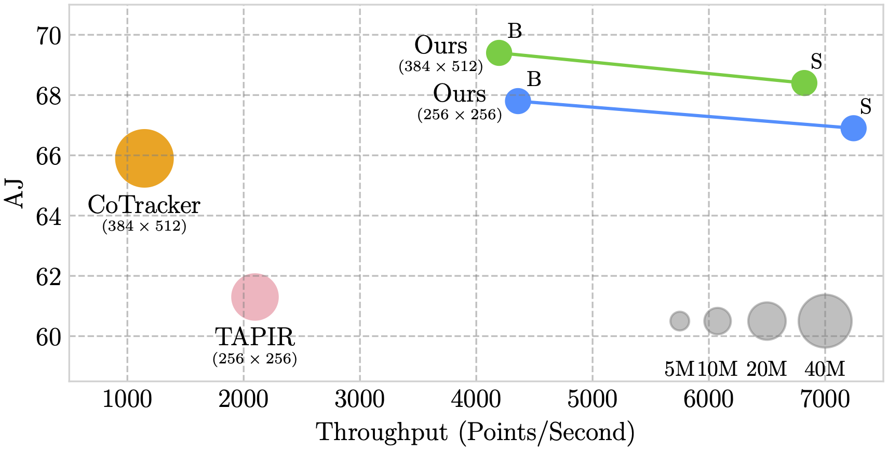

<div align="center">
<h1>Local All-Pair Correspondence for Point Tracking</h1>

[**Seokju Cho**](https://seokju-cho.github.io)<sup>1</sup> · [**Jiahui Huang**](https://gabriel-huang.github.io)<sup>2</sup> · [**Jisu Nam**](https://nam-jisu.github.io)<sup>1</sup> · [**Honggyu An**](https://hg010303.github.io)<sup>1</sup> · [**Seungryong Kim**](https://cvlab.korea.ac.kr)<sup>1</sup> · [**Joon-Young Lee**](https://joonyoung-cv.github.io)<sup>2</sup>

<sup>1</sup>Korea University&emsp;&emsp;&emsp;&emsp;<sup>2</sup>Adobe Research

**ECCV 2024**

<a href="https://arxiv.org/abs/2407.15420"></a>
<a href='https://ku-cvlab.github.io/locotrack'></a>
<a href='https://huggingface.co/spaces/hamacojr/LocoTrack'></a>

<p float='center'></p>
<span style="color: green; font-size: 1.3em; font-weight: bold;">LocoTrack is an incredibly efficient model,</span> enabling near-dense point tracking in real-time. It is <span style="color: red; font-size: 1.3em; font-weight: bold;">6x faster</span> than the previous state-of-the-art models.
</div>

---

## 项目改进说明
本项目基于原版 LocoTrack，主要将特征提取部分替换为 EfficientNet（目前已有的chekponit支持 b0、b2、b5 版本），并在调整了相关参数做了多次实验。相比原始实现，EfficientNet 能带来更优的速度与精度权衡。

---

## 关键脚本说明
*   **[combined_tracker_faceparsing_multi.py](https://github.com/zyp-up/locotrack-pytorch-efficientnet/blob/main/combined_tracker_faceparsing_multi.py)**：该脚本为一个通用的人脸跟踪器脚本，如果需要修改，只需要将对应的检测器和跟踪器换成您的特定需求，就可以在任何视频场景实现多目标跟踪。

---

## Training and Evaluation
For detailed instructions on training and evaluation, please refer to the README file for your chosen implementation:

- **[JAX Implementation](./locotrack/README.md)**
- **[PyTorch Implementation](./locotrack_pytorch/README.md)**

## Evaluation Dataset Preparation
First, download the evaluation datasets:
```bash
# TAP-Vid-DAVIS dataset
wget https://storage.googleapis.com/dm-tapnet/tapvid_davis.zip
unzip tapvid_davis.zip

# TAP-Vid-RGB-Stacking dataset
wget https://storage.googleapis.com/dm-tapnet/tapvid_rgb_stacking.zip
unzip tapvid_rgb_stacking.zip

# RoboTAP dataset
wget https://storage.googleapis.com/dm-tapnet/robotap/robotap.zip
unzip robotap.zip
```
For downloading TAP-Vid-Kinetics, please refer to official [TAP-Vid repository](https://github.com/google-deepmind/tapnet/tree/main/tapnet/tapvid).

---

## 实验结果（EfficientNet 不同版本对比）
| EfficientNet版本 | 数据集 | 精度 | 速度 | 备注 |
|------------------|--------|------|------|------|
| b0               |        |      |      |      |
| b2               |        |      |      |      |
| b5               |        |      |      |      |

（请在此处补充具体实验结果）

---

## ONNX 导出与转换注意事项

**参考脚本**：本项目提供了一个将模型转换为 ONNX 格式的示例脚本，详情请见 **[convert_onxx.py](https://github.com/zyp-up/locotrack-pytorch-efficientnet/blob/main/convert_onxx.py)**。

1. **grid_sample 兼容性**：原版 LocoTrack 使用了 5D 的 `grid_sample`，但 ONNX v20 及以下版本仅支持 4D。解决方案是将 5D 操作拆分为多次 4D 操作，具体如下：
**map_coordinates_3d 修改**：需将 `map_coordinates_3d` 函数实现为分步 2D grid_sample + 1D 线性插值，具体代码可参考下方示例：

   ```python
   def map_coordinates_3d(
       feats: torch.Tensor, coordinates: torch.Tensor
   ) -> torch.Tensor:
       """Maps 3D coordinates to corresponding features using bilinear interpolation."""
   
       # --- Modified Code for ONNX Export Compatibility ---
       # This modification replaces the 5D grid_sample with a 4D grid_sample
       # followed by a manual 1D linear interpolation, which is supported by ONNX exporter.
   
       B, _, _, _, C = feats.shape
       x = feats.permute(0, 4, 1, 2, 3)  # Shape: (B, C, W, H, D)
       B, C, W, H, D = x.shape
       N = coordinates.shape
   
       # Prepare coordinates, same as original
       y = coordinates[:, :, None, None, :].float()
       y[..., 0] = y[..., 0] + 0.5
       # Use float tensor for division
       shape_tensor = torch.tensor(x.shape[2:], device=y.device, dtype=torch.float32)
       y = 2 * (y / shape_tensor) - 1
       y = torch.flip(y, dims=(-1,))  # Coords are now in (D, H, W) order
   
       # Part 1: Perform 2D grid_sample over W and H for ALL D slices simultaneously
       y_hw = y[..., 1:]  # Shape: (B, N, 1, 1, 2), containing (H, W) coords
   
       # Reshape x from (B, C, W, H, D) to a "batch" of 2D images (B*D, C, W, H)
       x_perm = x.permute(0, 4, 1, 2, 3)  # Shape: (B, D, C, W, H)
       x_4d = x_perm.reshape(B * D, C, W, H)
   
       # Reshape grid to match the new batch of 2D images
       y_hw_grid = y_hw.permute(0, 1, 3, 2, 4).squeeze(2) # (B, N, 1, 2)
       y_hw_grid = y_hw_grid.expand(-1, -1, D, -1) # (B, N, D, 2)
       y_hw_grid = y_hw_grid.permute(0, 2, 1, 3).reshape(B * D, N, 1, 2) # (B*D, N, 1, 2)
   
       # Perform 2D sampling
       sampled_2d = F.grid_sample(
           x_4d, y_hw_grid, mode='bilinear', align_corners=False, padding_mode='border'
       )  # Shape: (B*D, C, N, 1)
   
       # Reshape back to get a tensor with a separate D dimension
       # Shape: (B, D, C, N) -> (B, C, N, D)
       sampled_all_d = sampled_2d.reshape(B, D, C, N).permute(0, 2, 3, 1)
   
       # Part 2: Manually perform linear interpolation along the D dimension
       y_d_norm = y[..., 0].squeeze(-1).squeeze(-1)  # Shape: (B, N), normalized coords [-1, 1]
   
       # Un-normalize D coordinate to a float index in range [0, D-1]
       d_coord = (y_d_norm + 1) / 2 * (D - 1)
   
       # Get the integer indices for lower and upper bounds
       d0 = torch.floor(d_coord).long().clamp(0, D - 2)
       d1 = d0 + 1
   
       # Gather the values from the lower and upper bounds
       # view/expand are used to create the correct indexing shape
       d0_idx = d0.view(B, 1, N, 1).expand(-1, C, -1, -1)
       V0 = sampled_all_d.gather(3, d0_idx).squeeze(3)  # Shape: (B, C, N)
   
       d1_idx = d1.view(B, 1, N, 1).expand(-1, C, -1, -1)
       V1 = sampled_all_d.gather(3, d1_idx).squeeze(3)  # Shape: (B, C, N)
   
       # Calculate interpolation weights
       w1 = (d_coord - d0).view(B, 1, N)  # Shape: (B, 1, N)
       w0 = 1 - w1
   
       # Perform the interpolation
       interpolated_val = w0 * V0 + w1 * V1  # Shape: (B, C, N)
   
       # Permute to the final desired shape (B, N, C)
       out = interpolated_val.permute(0, 2, 1)
   
       return out
   ```

3. **Squeeze 操作**：对于ONNX的任何版本，都不适合在代码中出现一次性squeeze多个维度。如果代码中一次性出现多个维度，需要将操作变为连续squeeze单个维度，例如 `.squeeze(3,4)` 应修改为 `.squeeze(4).squeeze(3)`。

4. **其他算子支持**：部分 PyTorch 算子在 ONNX 导出时可能不被支持，建议提前查阅 ONNX 文档并进行算子替换或自定义导出。


如需详细代码示例或遇到具体问题，欢迎随时交流。

## Training Dataset Preparation
Download the panning-MOVi-E dataset used for training (approximately 273GB) from Huggingface using the following script. Git LFS should be installed to download the dataset. To install Git LFS, please refer to this [link](https://docs.github.com/en/repositories/working-with-files/managing-large-files/installing-git-large-file-storage?platform=linux). Additionally, downloading instructions for the Huggingface dataset are available at this [link](https://huggingface.co/docs/hub/en/datasets-downloading)
```bash
git clone git@hf.co:datasets/hamacojr/LocoTrack-panning-MOVi-E
```

## 📚 Citing this Work
Please use the following bibtex to cite our work:
```
@article{cho2024local,
  title={Local All-Pair Correspondence for Point Tracking},
  author={Cho, Seokju and Huang, Jiahui and Nam, Jisu and An, Honggyu and Kim, Seungryong and Lee, Joon-Young},
  journal={arXiv preprint arXiv:2407.15420},
  year={2024}
}
```

## 🙏 Acknowledgement
This project is largely based on the [LocoTrack repository](https://github.com/cvlab-kaist/locotrack). Thanks to the authors for their invaluable work and contributions.